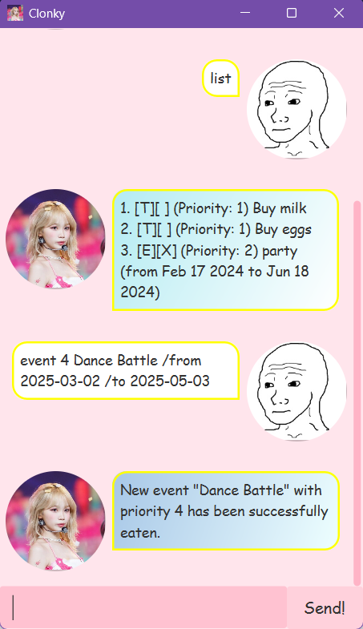

# ***Clonky*** User Guide
 
 ***Clonky*** is an easy-to-use, versatile and attractive task manager.

 Here's ***Clonky*** in action!



What ***Clonky*** can do:

- [X] Store Todos, Deadlines, and Events
- [X] Set deadlines for, well, deadlines
- [X] Set from and to dates for Events
- [X] Save your tasks across sessions
- [X] Mark tasks as done/undone
- [ ] ~~Mine bitcoin~~

## Adding Tasks

***Clonky*** can manage your tasks with an associated priority and description! Clonky supports 3 types of tasks:

1. **Todo** (Contains just a priority and description)
2. **Deadline** (Contains a priority, description, and deadline date)
3. **Event** (Contains a priority, description, and start and end dates)

### Adding Todos

Todos can be specified with the `todo` command, in the format:

```
todo {priority} {description}
```

Example: `todo 1 Buy eggs from the store`

***Clonky*** will confirm if the task has been added:

```
New todo "Buy eggs from the store" with priority 1 has been successfully eaten.
```

### Adding Deadlines

Deadlines can be added with the `deadline` command, in the format:

```
deadline {priority} {description} /by {YYYY-MM-DD}
```

Example: `deadline 1 Find love /by 2025-06-11`

***Clonky*** will confirm if the deadline has been added successfully:

```
New deadline "Find love" with priority 1 has been succesfully eaten."
```

### Adding Events

Events can be added to ***Clonky***'s memory with the `event` command, in the format:

```
event {priority} {description} /from {YYYY-MM-DD} /to {YYYY-MM-DD}
```

Example: `event 2 Court Trial /from 2025-02-18 /to 2025-03-22`

***Clonky*** will confirm if the event has been successfully added:

```
New event "Court Trial" with priority 2 has been successfully eaten.
```

## Listing Tasks

See what tasks you have stored in Clonky with ***list***

***Clonky*** will display tasks in the form `[Type][Done] (Priority) {Description} (Additional information)`

Examples:

- `[T][ ] (Priority: 1) Buy eggs`
- `[D][X] (Priority: 2) Find love (by: Jun 11 2025)`
- `[E][ ] (Priority: 1) Dinner (from Feb 3 2025 to Feb 4 2025)`

## Marking Tasks

***Clonky*** can help you mark tasks that have been completed as well! Just use the `mark` command, in the format:

```
mark {index}
```

`{index}` refers to the index of the task involved, which, if unsure, can be checked with the `list` command.

***Clonky*** will affirm if the task is successfully marked:

Example: `mark 1`

```
Task {description} successfully marked as done.
```

## Unmarking Tasks

In a similar vein as above, ***Clonky*** can also unmark marked tasks with the `unmark` command, in the format:
```
unmark {index}
```

Example: `unmark 1`

## Removing Tasks

If you have no more need for tasks, ***Clonky*** can remove them with the `ANNIHILATE` command:

```
ANNIHILATE {index}
```

`{index}` here is used similarly to `mark` and `unmark`, where it represents the index of the task in ***Clonky***

Example: `ANNIHILATE 3`

***Clonky*** will (nonchalantly) remove the task from the list:
```
Task successfully removed.
[T][ ] (Priority: 1) Buy eggs from the store
```

## Finding Tasks

***Clonky*** can find tasks by their description with `find desc`:

```
find desc {parameter}
```

Example: `find desc eggs`

***Clonky*** will return the number of tasks, and the tasks whose description contains the parameter provided:
```
There are 1 tasks that contained buy eggs
1. [T][ ] (Priority: 1) Buy eggs
Find what you need?
```

## Saving/Loading Tasks

After every operation, ***Clonky*** will save tasks to `clonky/tasks.txt`, and will automatically attempt to load from it on startup.

If you would like ***Clonky*** to load a different set of tasks, you can replace the `clonky/tasks.txt` file. If it is not found or unable to be read, ***Clonky*** will just initialize with no tasks.

At any time, the current tasks can be manually saved with the `save` command:
```
save
```

***Clonky*** will report if file saving is successful.

## Closing ***Clonky***

Close ***Clonky*** with the `bye` command.

Example: `bye`
